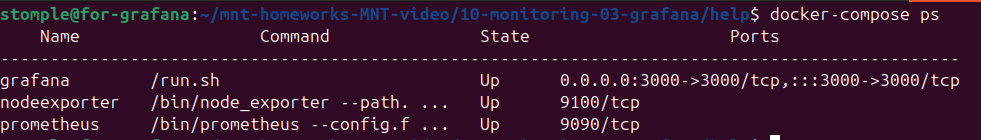
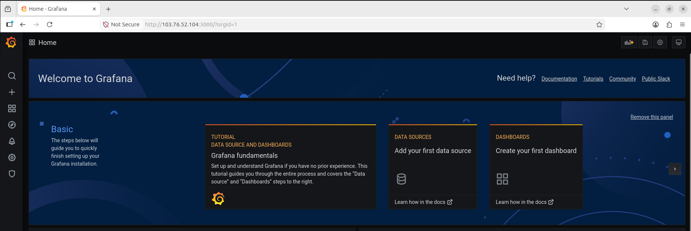
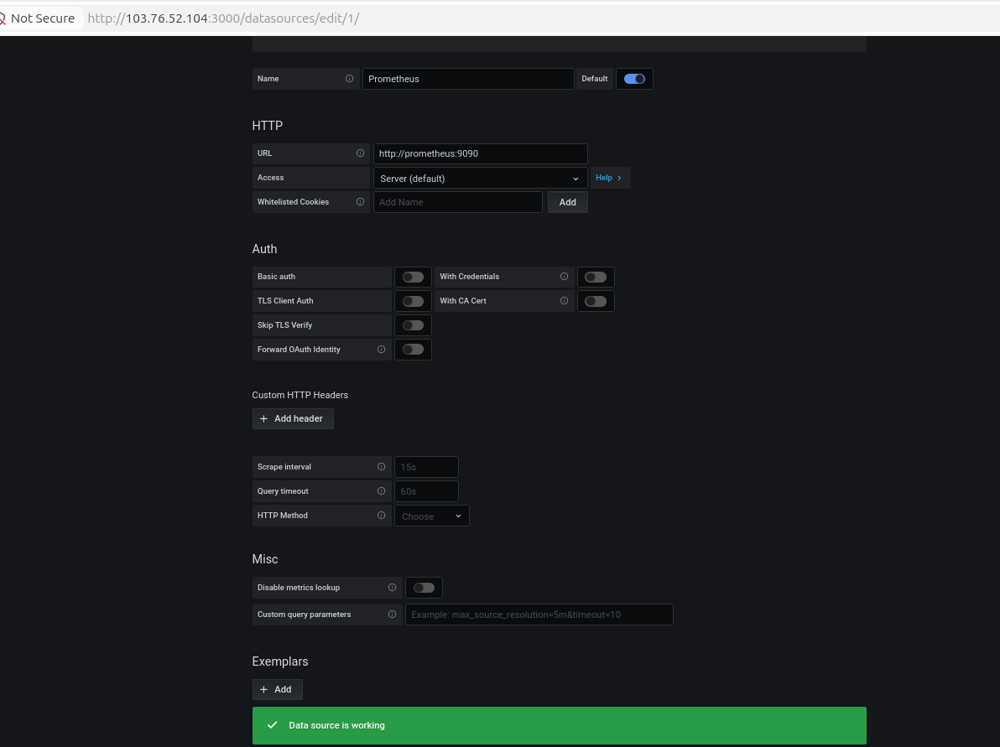
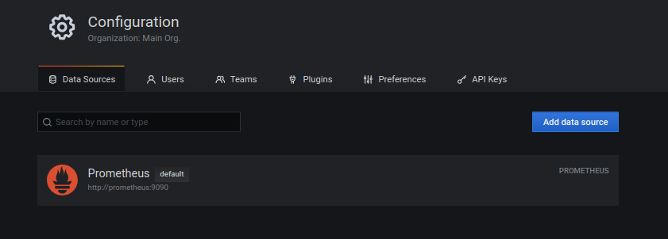
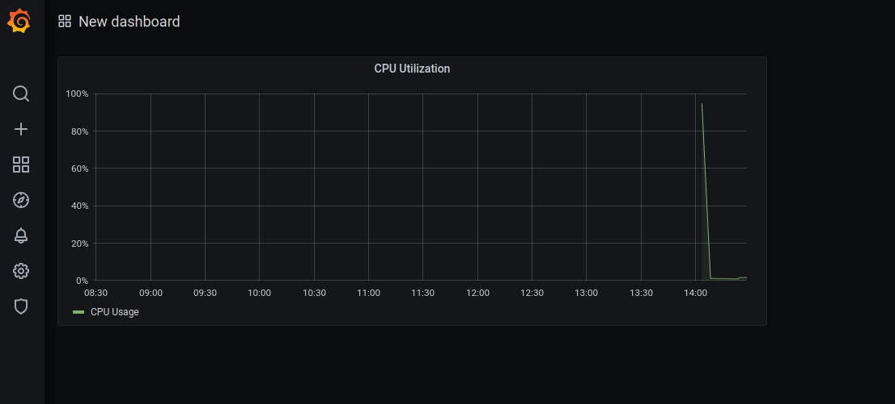
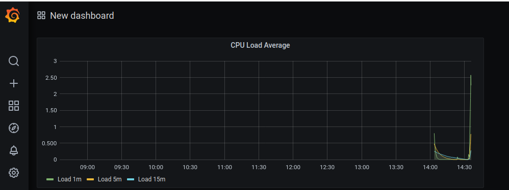
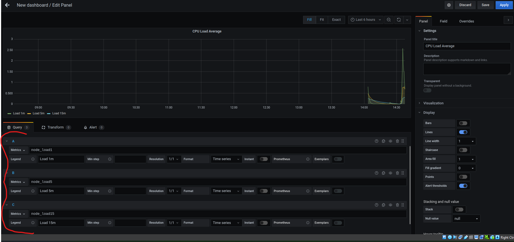
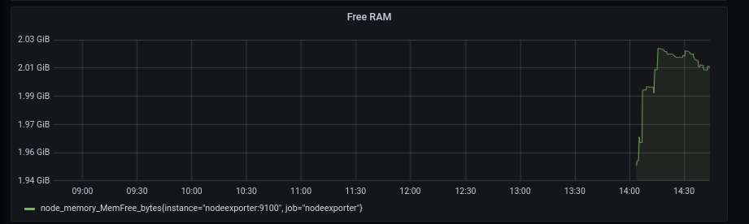
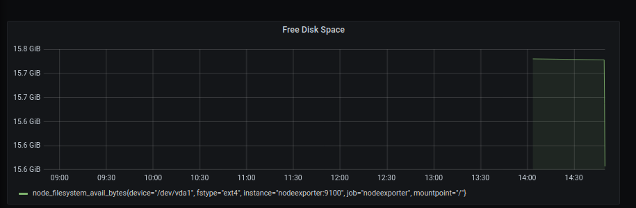
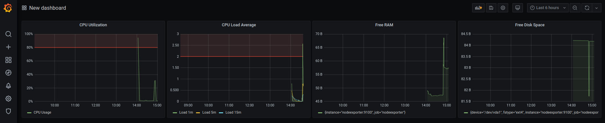

# Домашнее задание к занятию 14 «Средство визуализации Grafana» Соколов Тимофей

## Обязательные задания

### Задание 1

1. Используя директорию [help](./help) внутри этого домашнего задания, запустите связку prometheus-grafana.

2. Зайдите в веб-интерфейс grafana, используя авторизационные данные, указанные в манифесте docker-compose.

3. Подключите поднятый вами prometheus, как источник данных.

4. Решение домашнего задания — скриншот веб-интерфейса grafana со списком подключенных Datasource.

## Задание 2

Изучите самостоятельно ресурсы:

1. [PromQL tutorial for beginners and humans](https://valyala.medium.com/promql-tutorial-for-beginners-9ab455142085).
2. [Understanding Machine CPU usage](https://www.robustperception.io/understanding-machine-cpu-usage).
3. [Introduction to PromQL, the Prometheus query language](https://grafana.com/blog/2020/02/04/introduction-to-promql-the-prometheus-query-language/).

Создайте Dashboard и в ней создайте Panels:

- утилизация CPU для nodeexporter (в процентах, 100-idle);

100 - (avg(rate(node_cpu_seconds_total{mode="idle"}[5m])) * 100)

- CPULA 1/5/15;

- количество свободной оперативной памяти;

(node_memory_MemTotal_bytes - node_memory_MemFree_bytes) / node_memory_MemTotal_bytes * 100

- количество места на файловой системе.

(node_filesystem_avail_bytes{mountpoint="/", fstype!="rootfs"} / node_filesystem_size_bytes{mountpoint="/", fstype!="rootfs"}) * 100

Для решения этого задания приведите promql-запросы для выдачи этих метрик, а также скриншот получившейся Dashboard.

## Задание 3

1. Создайте для каждой Dashboard подходящее правило alert — можно обратиться к первой лекции в блоке «Мониторинг».
2. В качестве решения задания приведите скриншот вашей итоговой Dashboard.

На последних двух панелях зону алерта не видно, из-за указанных значений. 
Free RAM - WHEN avg() OF query(A, 5m) IS BELOW 500000000 (For: 2m)
Free Disk Space - WHEN avg() OF query(A, 5m) IS BELOW 10 (For: 5m)

## Задание 4

1. Сохраните ваш Dashboard.Для этого перейдите в настройки Dashboard, выберите в боковом меню «JSON MODEL». Далее скопируйте отображаемое json-содержимое в отдельный файл и сохраните его.
2. В качестве решения задания приведите листинг этого файла.

В директории оставил файл dashboard.json, в котором оставил код итогового дашборда

---

### Как оформить решение задания

Выполненное домашнее задание пришлите в виде ссылки на .md-файл в вашем репозитории.
